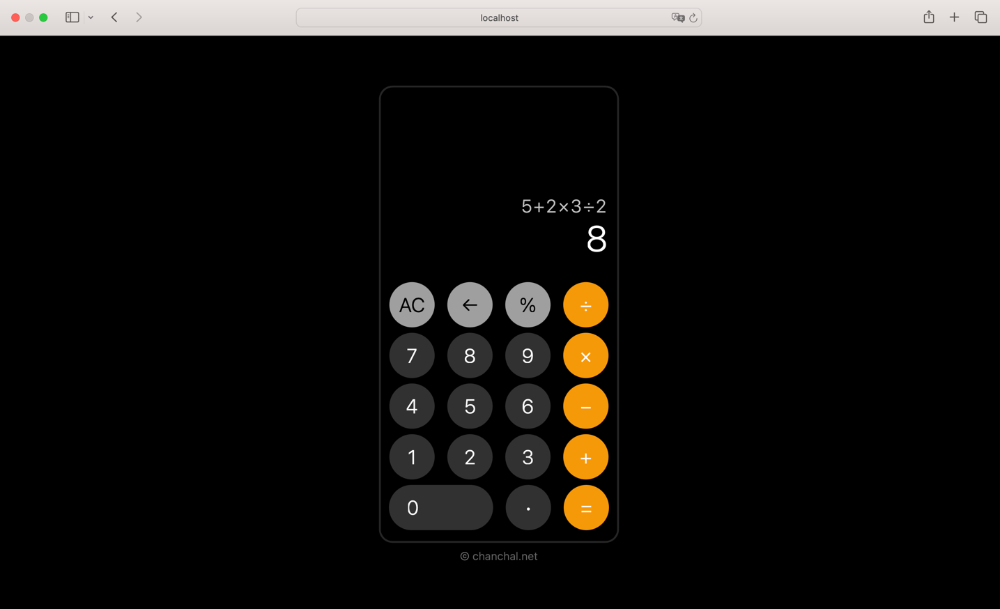

# Calculator Application 

HTML, CSS and JavaScript have been used to design and develop this application.

### Application Screenshot



### index.html

```html
<!DOCTYPE html>
<html lang="en">
<head>
    <meta charset="UTF-8">
    <meta name="viewport"
          content="width=device-width, user-scalable=no, initial-scale=1.0, maximum-scale=1.0, minimum-scale=1.0">
    <meta http-equiv="X-UA-Compatible" content="ie=edge">
    <title>Calculator</title>
    <link rel="stylesheet" href="style.css">
</head>
<body>
    <div class="calculator">
        <div class="display">
            <input type="hidden" id="input-math-expression">
            <div class="input">
                <!-- For JS Response -->
            </div>
            <div class="output">
                <!-- For JS Response -->
            </div>
        </div>
        <div class="control">
            <div class="row">
                <button value="ac" class="bg-3">AC</button>
                <button value="ce" class="bg-3">&#8592;</button>
                <button value="%" class="bg-3">&#37;</button>
                <button value="/" class="bg-2">&#247;</button>
            </div>
            <div class="row">
                <button value="7" class="bg-1">7</button>
                <button value="8" class="bg-1">8</button>
                <button value="9" class="bg-1">9</button>
                <button value="*" class="bg-2">&#215;</button>
            </div>
            <div class="row">
                <button value="4" class="bg-1">4</button>
                <button value="5" class="bg-1">5</button>
                <button value="6" class="bg-1">6</button>
                <button value="-" class="bg-2">&#8722;</button>
            </div>
            <div class="row">
                <button value="1" class="bg-1">1</button>
                <button value="2" class="bg-1">2</button>
                <button value="3" class="bg-1">3</button>
                <button value="+" class="bg-2">&#43;</button>
            </div>
            <div class="row">
                <button value="0" class="bg-1 zero">0</button>
                <button value="." class="bg-1">&#8729;</button>
                <button value="=" class="bg-2">&#61;</button>
            </div>
        </div>

        <p class="copyright">&copy; <a href="https://chanchal.net">chanchal.net</a></p>
    </div>

    <script src="script.js"></script>
</body>
</html>
```

### style.css

```css
* {
    margin: 0;
    padding: 0;
    box-sizing: border-box;
}

::-webkit-scrollbar {
    width: 0
}

html {
    height: 100%;
}
body {
    background: #000000;
    height: 100%;
    display: flex;
    align-items: center;
    justify-content: center;
    font-weight: 300;
    font-family: system-ui, sans-serif;
}

.calculator {
    width: 265px;
    height: 505px;
    background: #000000;
    border-radius: 15px;
    border: solid 2px #262626;
    transform: scale(1.3,1.3);
}

.display {
    height: 212px;
    background: #000000;
    border-radius: 15px 15px 0 0;
    color: #ffffff;
    padding: 10px;
    display: flex;
    flex-direction: column;
    justify-content: flex-end;
    align-items: flex-end;
}

.input {
    font-size: 20px;
    letter-spacing: 2px;
    color: #c2c2c2;
    text-align: right;
    overflow-y: scroll;
    word-wrap: break-word;
    width: 100%;
}

.output {
    font-size: 40px;
    height: 60px;
    overflow-x: scroll;
    overflow-y: hidden;
    width: 100%;
    text-align: right;
}

.control {
    display: flex;
    align-items: center;
    flex-direction: column;
}

.row {
    margin: 3px 0;
}

button {
    font-size: 22px;
    width: 50px;
    border-radius: 50px;
    margin: 0 5px;
    height: 50px;
    border: none;
    background: transparent;
    color: #ffffff;
    font-weight: 300;
    font-family: system-ui, sans-serif;
}

button:active {
    opacity: 0.8;
}

.bg-1 {
    background: #313131;
}

.bg-2 {
    background: #f69908;
}

.bg-3 {
    background: #9f9f9f;
    color: #000000;
}

.zero {
    width: 115px;
    text-align: left;
    text-indent: 20px;
}

.copyright {
    color: #767676;
    text-align: center;
    margin-top: 18px;
    font-size: 12px;
}

.copyright a {
    color: #656464;
    text-decoration: none;
}
```

### script.js

```javascript
"use strict";

const element = (selector) => {
    return document.querySelector(selector);
}

const replaceCharacter = (character) => {
    if (character === '-') {
        return '&#8722;';
    }
    else if (character === '+') {
        return '&#43;';
    }
    else if (character === '*') {
        return '&#215;';
    }
    else if (character === '/') {
        return '&#247;';
    }
    else if (character === '%') {
        return '&#37;';
    }
    else {
        return character;
    }
}

const displayInput = (character) => {
    element('#input-math-expression').value += character;
    element('.input').innerHTML += replaceCharacter(character);
}

const allClear = () => {
    element('#input-math-expression').value = '';
    element('.input').innerHTML = '';
    element('.output').innerHTML = '';
}

const clearEntry = () => {
    const input_math_expression = element('#input-math-expression').value.slice(0, -1);
    const input = element('.input').innerHTML.slice(0, -1);

    element('#input-math-expression').value = input_math_expression;
    element('.input').innerHTML = input;
    element('.output').innerHTML = '';
}

const calculation = () => {
    const input_math_expression = element('#input-math-expression').value;

    try {
        element('.output').innerHTML = eval(input_math_expression);
    }
    catch (error) {
        element('.output').innerHTML = 'Error';
    }
}

document.querySelectorAll('button').forEach(element => {
    element.addEventListener('click', function() {

        if (this.value === 'ac') {
            allClear();
        }
        else if (this.value === 'ce') {
            clearEntry();
        }
        else if (this.value === '=') {
            calculation();
        }
        else {
            displayInput(this.value);
        }
    });
});
```