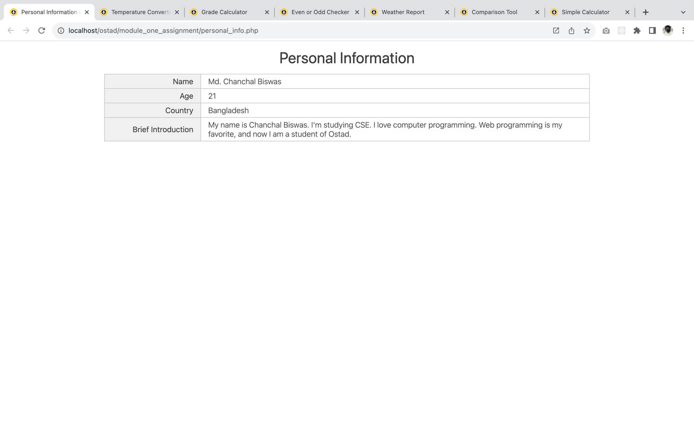
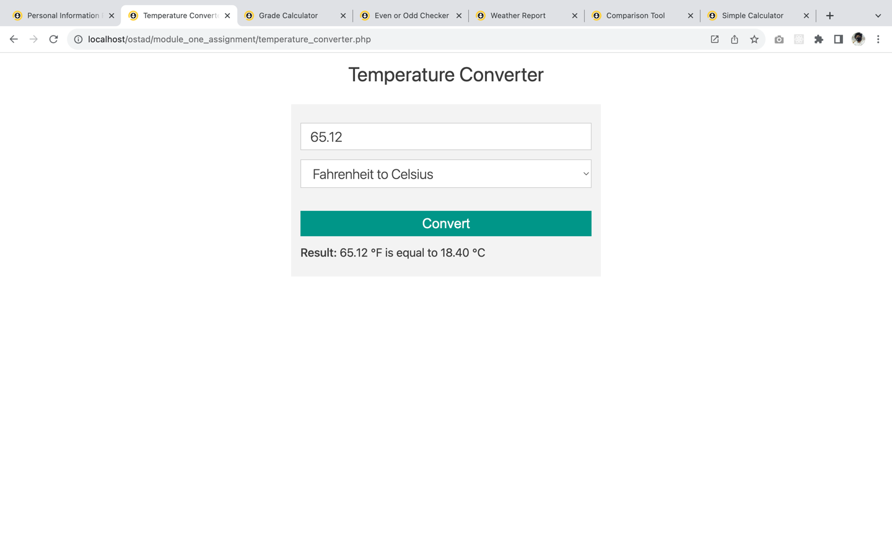
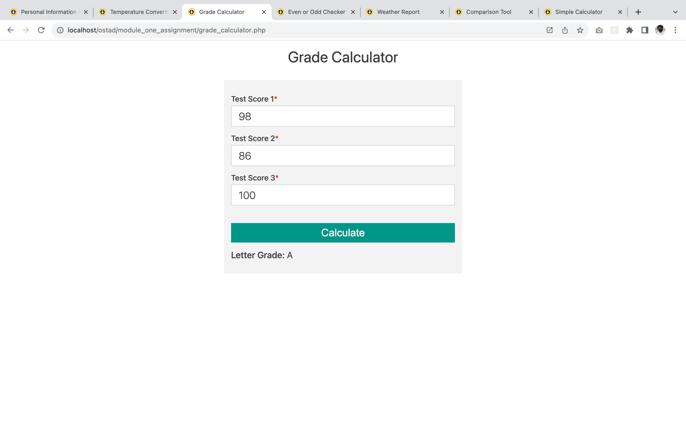
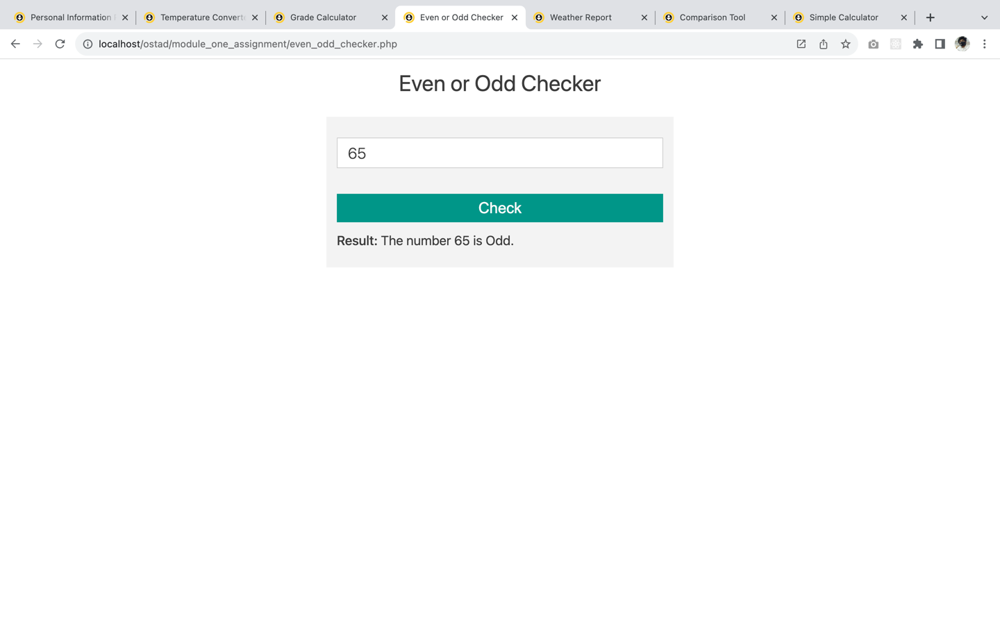
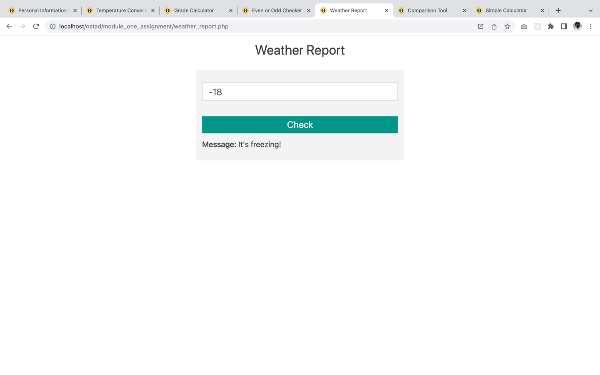
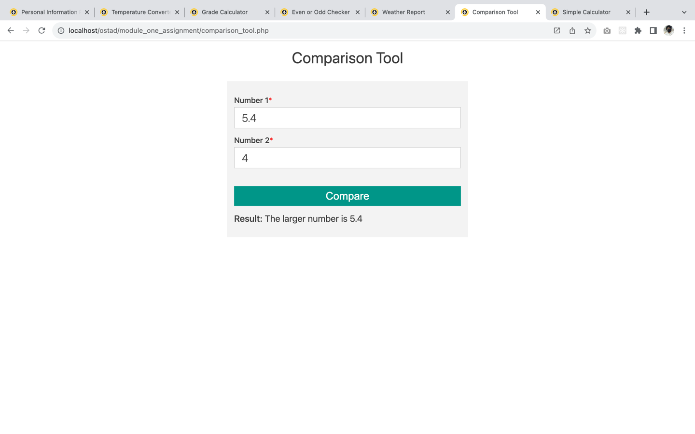
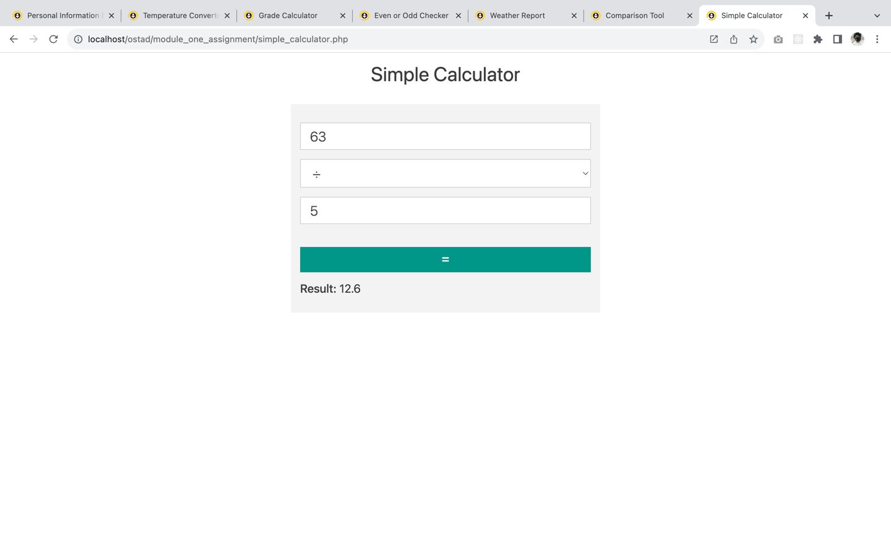

# Assignment: PHP Fundamentals Assignment

### Task 1: Personal Information Page
Create a PHP file named personal_info.php that displays your personal information using variables and the echo statement. Include your name, age, country, and a brief introduction.

#### Output Screenshot:

[View source code](personal_info.php)

### Task 2: Temperature Converter
Design a PHP program called temperature_converter.php that converts temperatures between Celsius and Fahrenheit. Provide a form where the user can input a temperature value and select the conversion direction (Celsius to Fahrenheit or vice versa). Display the converted temperature.

#### Output Screenshot:

[View source code](temperature_converter.php)

### Task 3: Grade Calculator
Develop a PHP script named grade_calculator.php that computes the average of three test scores and determines the corresponding letter grade. Create a form where the user can input three test scores. Calculate the average and display it along with the corresponding grade (A, B, C, D, F).

#### Output Screenshot:

[View source code](grade_calculator.php)

### Task 4: Even or Odd Checker
Build a PHP program called even_odd_checker.php that checks whether a given number is even or odd. Provide an input field where the user can enter a number. Display a message indicating whether the number is even or odd.

#### Output Screenshot:

[View source code](even_odd_checker.php)

### Task 5: Weather Report
Create a PHP script named weather_report.php that provides weather information based on temperature. Use a variable to store the temperature. Depending on the temperature range, display messages like "It's freezing!", "It's cool.", or "It's warm."

#### Output Screenshot:

[View source code](weather_report.php)

### Task 6: Comparison Tool
Develop a PHP tool named comparison_tool.php that compares two numbers and displays the larger one using the ternary operator. Create a form where the user can input two numbers. Use the ternary operator to determine the larger number and display the result.

#### Output Screenshot:

[View source code](comparison_tool.php)

### Task 7: Simple Calculator
Build a PHP calculator named simple_calculator.php that performs basic arithmetic operations. Provide input fields for two numbers and a dropdown to select the operation (addition, subtraction, multiplication, division). Display the result of the chosen operation.

Complete these tasks by writing PHP code that fulfills the requirements of each task. Feel free to enhance the tasks or add extra features if you'd like. This assignment will help you practice your PHP skills and apply the concepts you've learned. Good luck!

#### Output Screenshot:

[View source code](simple_calculator.php)