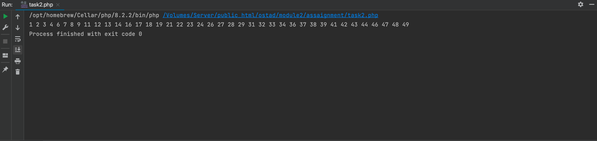
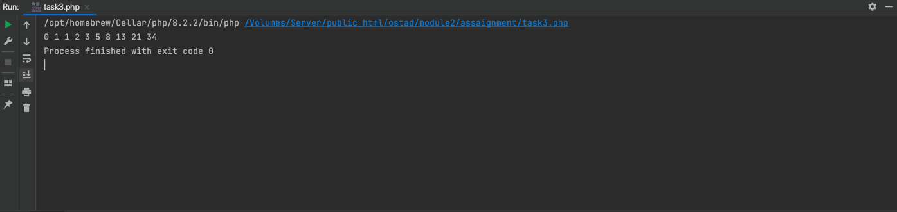

# Assignment: Module 2 Assignment

### Task 1: Looping with Increment using a Function
Write a PHP function that uses a for loop to print all even numbers from 1 to 20, but with a
step of 2. In other words, you should print 2, 4, 6, 8, 10, 12, 14, 16, 18, 20. The function
should take the arguments like start as 1, end as 20 and step as 2. You must call the
function to print.
Also do the same using while loop and do-while loop also.

#### Output Screenshot:

[View source code](task1.php)

### Task 2: Skip Multiples of 5
Create a PHP script that prints numbers from 1 to 50 using a for loop. However, when the
loop encounters a multiple of 5, it should skip that number using the continue statement and
continue to the next iteration.

#### Output Screenshot:

[View source code](task2.php)

### Task 3: Break on Condition
Write a PHP program that calculates and prints the first 10 Fibonacci numbers. But, if a
Fibonacci number is greater than 100, break out of the loop using the break statement.

#### Output Screenshot:

[View source code](task3.php)

### Task 4: Fibonacci Series printing using a Function
Write a PHP function to print the first 15 numbers in the Fibonacci series. You should take
this 15 as an argument of a function and use a for loop to generate these numbers and print
them by calling the function.

#### Output Screenshot:

[View source code](task4.php)