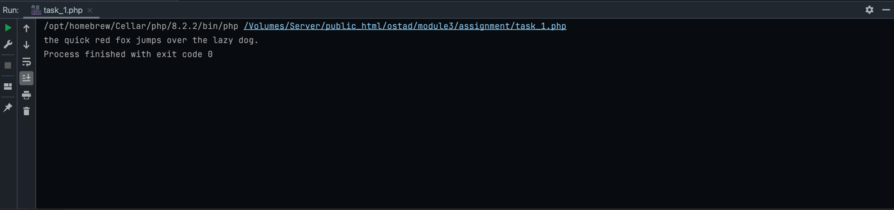
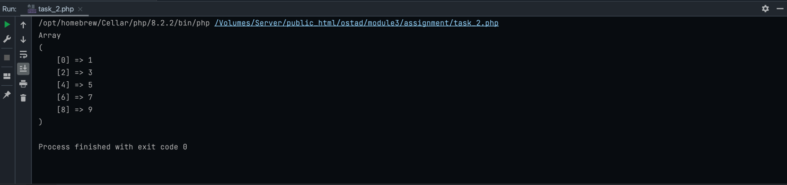
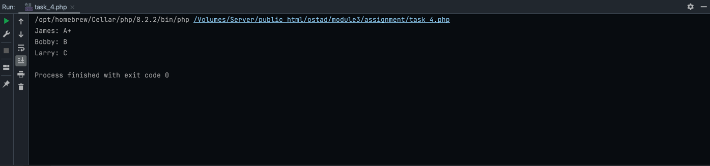
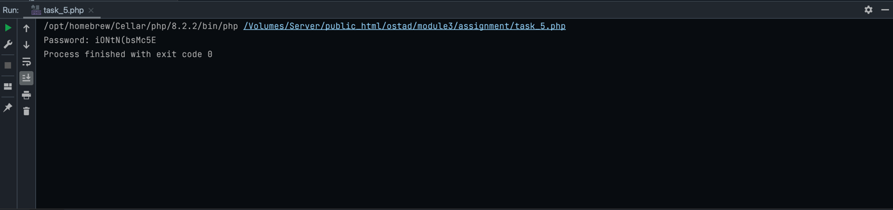

# Assignment: Module 3 Assignment

### Task 1: String Manipulation
Create a string variable called $text with the value "The quick brown fox jumps over the lazy dog.". 
Write a PHP function which takes `$text` as an argument to:

Convert the string to all lowercase.

Replace 'brown' with 'red' in the string.

Print the modified text.

#### Output Screenshot:

[View source code](task_1.php)

### Task 2: Array Manipulation
Create an array called `$numbers` containing the numbers 1 to 10. Write a PHP function which takes the `$numbers` array 
as an argument to remove the even numbers from the array and print the resulting array.

#### Output Screenshot:

[View source code](task_2.php)

### Task 3: Array Sorting
Create an array called `$grades` with the following values: 85, 92, 78, 88, 95. Write a PHP function which takes 
`$grades` as an argument to sort the array in descending order and print the sorted grades as array.
#### Output Screenshot:

[View source code](task_3.php)

### Task 4: Multidimensional Array
Create a multidimensional array called `$studentGrades` to store the grades of three students. 
Each student has grades for three subjects: Math, English, and Science. Write a PHP function which takes
`$studentGrades` as an argument to calculate and print the average grade for each student.
#### Output Screenshot:

[View source code](task_4.php)

### Task 5: Password Generator
Create a PHP function called `generatePassword($length)` that generates a random password of the specified length. 
The password should include lowercase letters, uppercase letters, numbers, and special characters (!@#$%^&*()_+). 
Write a PHP program to generate a password with a length of 12 characters using this function and print the password.
#### Output Screenshot:

[View source code](task_5.php)

__Submission Instructions :__

1. Name your files as 
   1. task_1.php
   2. task_2.php
   3. task_3.php
   4. task_4.php
   5. task_5.php

2. Do not create any separate folder inside your repository. Only push (.php) files.

3. Do not use any HTML, CSS for this assignment.