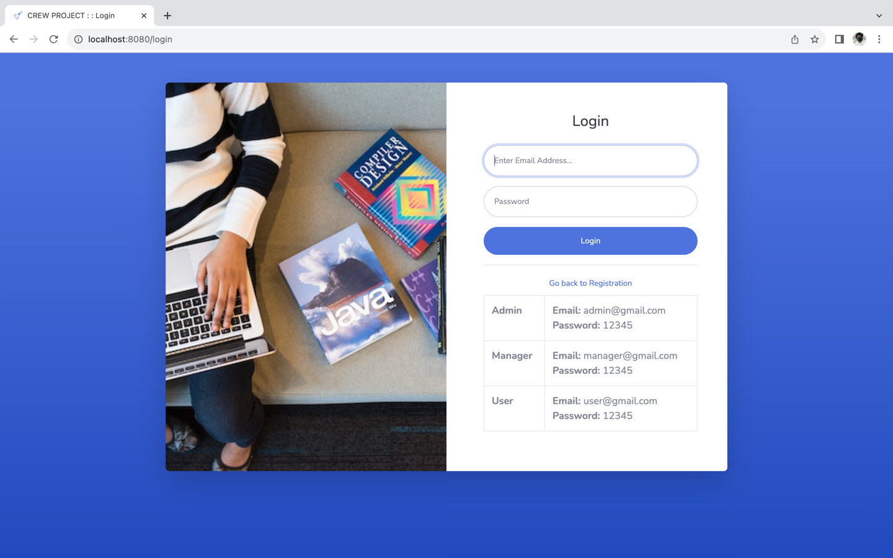
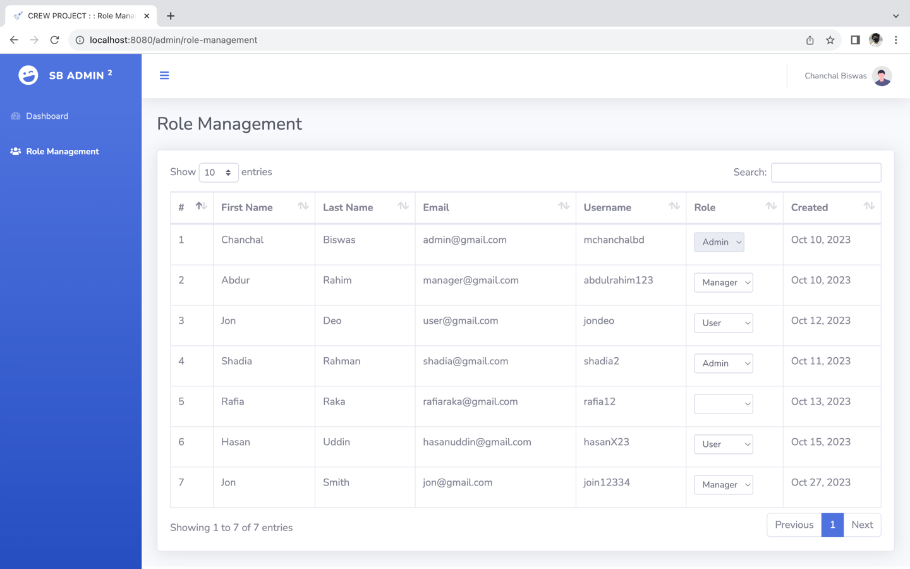
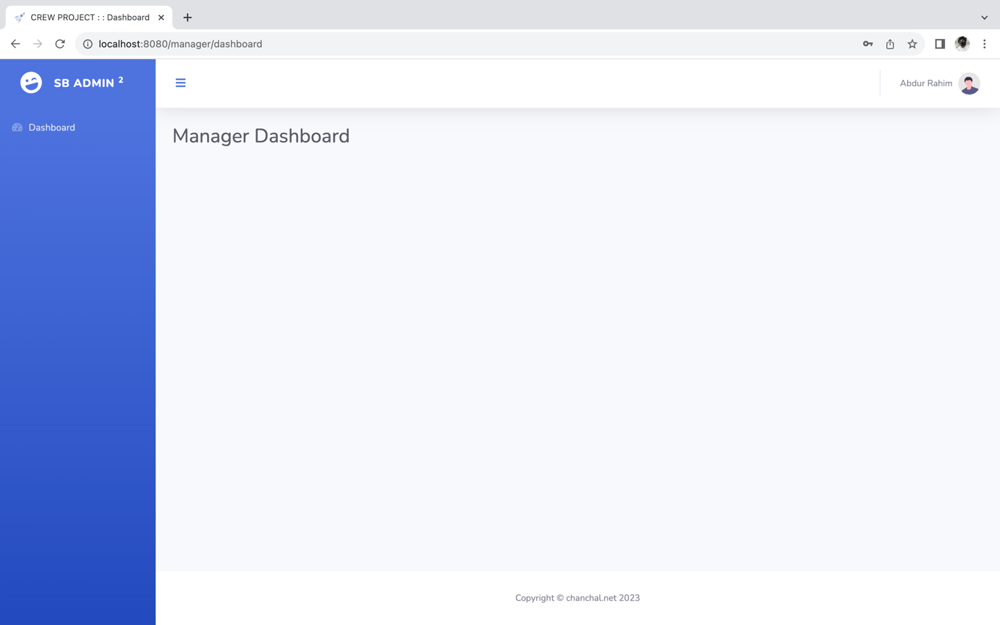
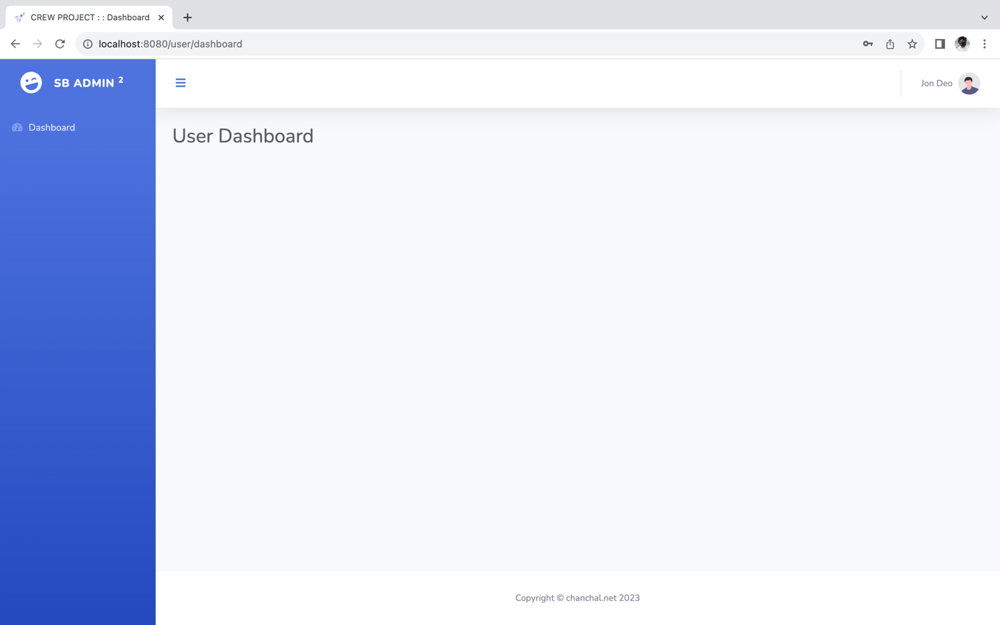
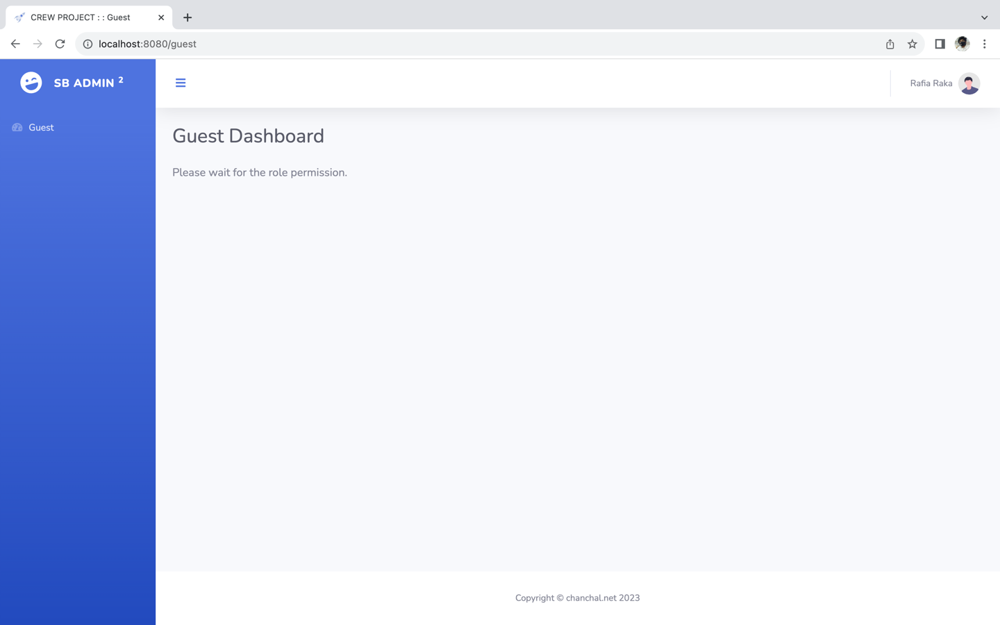

# CREW Project
It is Crew Project web application that user authentication and role management using PHP. [Project Requirement](../README.md)

__Project Directory Structure__ 
```text
└── crew_project/
    ├── assets/
    │   ├── css/
    │   ├── img/
    │   ├── js/
    │   └── ...
    ├── includes/
    │   ├── config.php
    │   ├── functions.php
    │   └── ...
    ├── libs/
    │   ├── database/
    │   ├── session/
    │   ├── template/
    │   └── ...
    ├── pages/
    ├── storages/
    │   ├── cache/
    │   ├── data/
    │   └── logs/
    ├── .htaccess
    ├── index.php
    └── README.md
```

There are 3 different libraries for this project and this library is written by me.
1. [CSV Database Library](libs/database)
2. [Session Library](libs/session)
3. [Template Engine Library](libs/template)

### Requirements
```text
PHP version ^8.0.0
```

### Project Setup
```gitexclude
git clone --depth 1 --filter=blob:none --sparse https://github.com/net-chanchal/ostad.git
cd ostad
git sparse-checkout init --cone
git sparse-checkout set module5/assignment/crew_project
cd module5/assignment/crew_project

php -S localhost:8080
```

Open browser and this URL: [localhost:8080](localhost:8080)

### Application Output Screenshots

__Login__



__Registration__


___

### Admin Control Panel

__Dashboard__


__Role Management__



___
### Manager Control Panel

__Dashboard__



___
### User Control Panel

__Dashboard__



___
### Guest Control Panel

__Guest__


