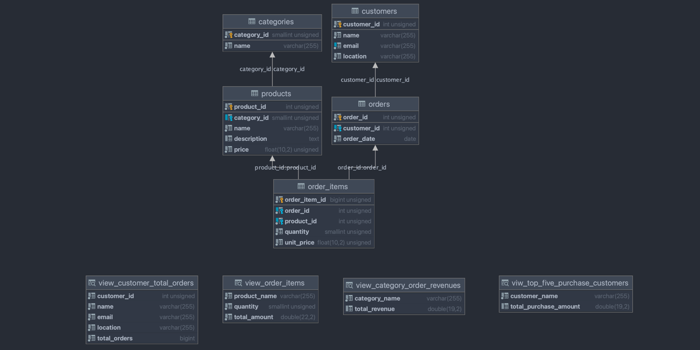
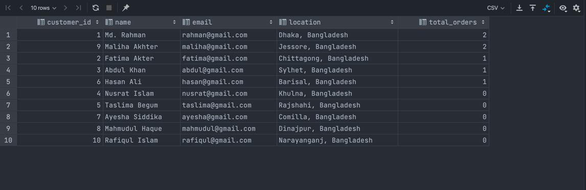
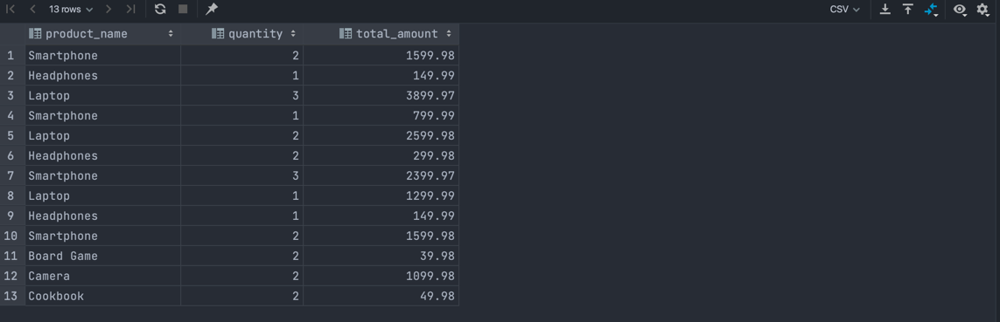
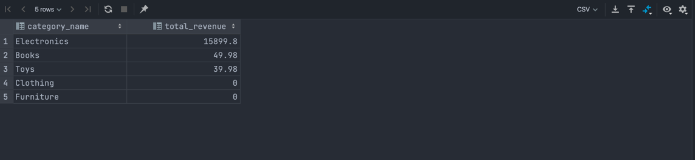
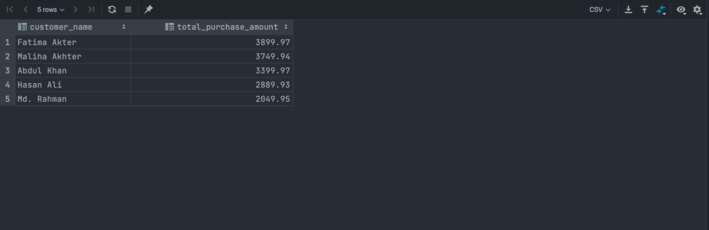

# Project Solution Documentation

Solving Real-Life Business Problems using SQL. [Project Requirement](../README.md)

Based on the project requirements, this diagram has been planned, and the corresponding tables and table views have been
created.

- [tables.sql](tables.sql)
- [views.sql](views.sql) _(Here are 4 tasks solved by creating views.)_
- [data.sql](data.sql)

__Database Setup:__

1. Create a database `ostad_real_life_business`
2. Create all tables [tables.sql](tables.sql)
3. Create all views [views.sql](views.sql)
4. Insert all dummy data [data.sql](data.sql)

__Database Diagram:__  


__Notice:__ I skip a field (`total_amount`) in the orders table from [Project Requirement](../README.md). It's not
important. The total amount will be calculated from the `order_items` table.

_I created a view for solving each task. Here are two ways of query direct and query from view. Please see below._

__Task 1:__

```sql
SELECT t1.*,
       COUNT(t2.`customer_id`) AS `total_orders`
FROM `customers` t1
         LEFT JOIN `orders` t2 ON t1.`customer_id` = t2.`customer_id`
GROUP BY t1.`customer_id`
ORDER BY `total_orders` DESC;
```

_OR_

```sql
-- Query from view
SELECT *
FROM `view_customer_total_orders`;
```



___

__Task 2:__

```sql
SELECT t2.`name`                         AS `product_name`,
       t1.`quantity`,
       (t1.`quantity` * t1.`unit_price`) AS total_amount
FROM order_items t1
         INNER JOIN `products` t2 ON t1.`product_id` = t2.`product_id`
ORDER BY t1.`order_id`;
```

_OR_

```sql
-- Query from view
SELECT *
FROM `view_order_items`;
```



___

__Task 3:__

```sql
SELECT t1.`name`                                       AS `category_name`,
       IFNULL(SUM(t3.`quantity` * t3.`unit_price`), 0) AS `total_revenue`
FROM `categories` t1
         LEFT JOIN `products` t2 ON t1.`category_id` = t2.`category_id`
         LEFT JOIN `order_items` t3 ON t2.`product_id` = t3.`product_id`
GROUP BY t1.`name`
ORDER BY `total_revenue` DESC;
```

_OR_

```sql
-- Query from view
SELECT *
FROM `view_category_order_revenues`;
```



___

__Task 4:__

```sql
SELECT t1.`name`                            AS `customer_name`,
       SUM(t3.`quantity` * t3.`unit_price`) AS `total_purchase_amount`
FROM `customers` t1
         INNER JOIN `orders` t2 ON t1.`customer_id` = t2.`customer_id`
         INNER JOIN `order_items` t3 ON t2.`order_id` = t3.`order_id`
GROUP BY t1.`name`
ORDER BY `total_purchase_amount` DESC
LIMIT 5;
```

_OR_

```sql
-- Query from view
SELECT *
FROM `viw_top_five_purchase_customers`;
```


